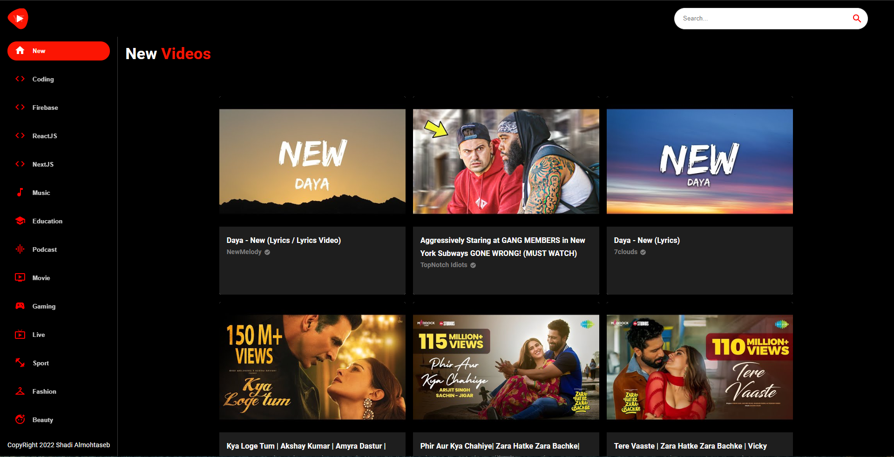
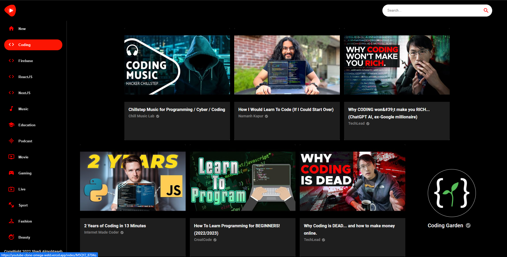
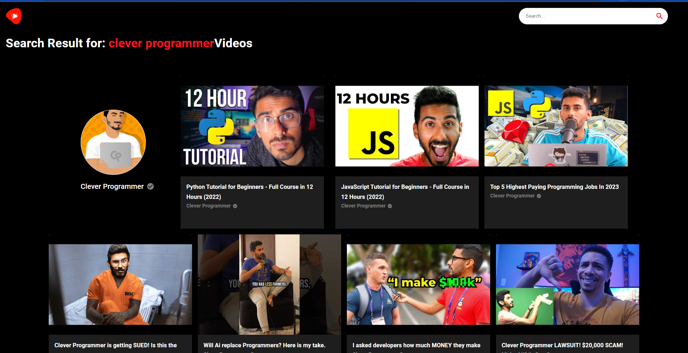
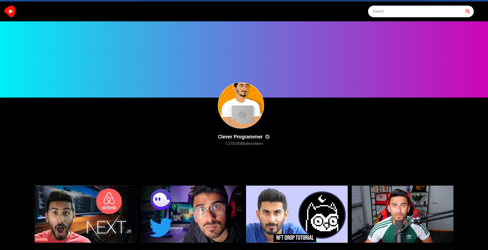
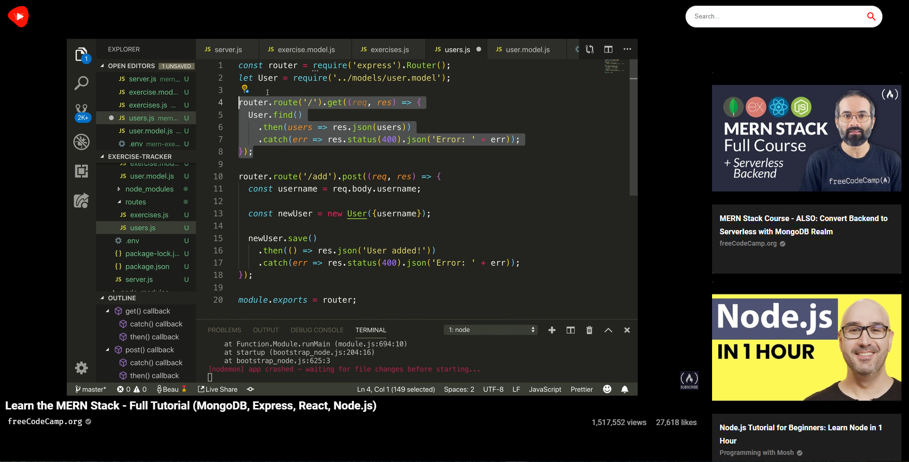
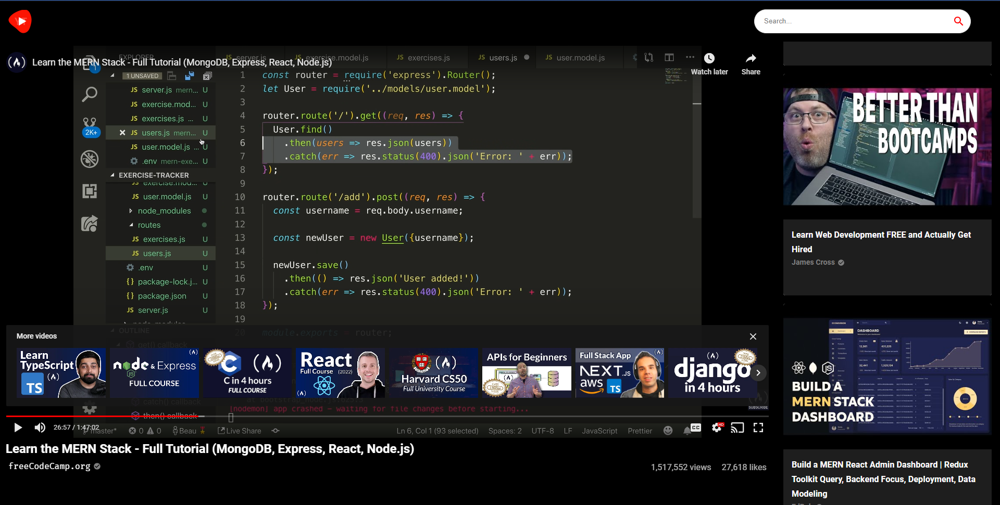

# Youtube Clone application

using a youtube API this app was built with beautiful UI and performance

## Learning Objectives

 - React Player
 - React Router Dom
 - Fetch requests from youtube API

## Demo

https://youtube-clone-omega-weld.vercel.app/

## App Preview

